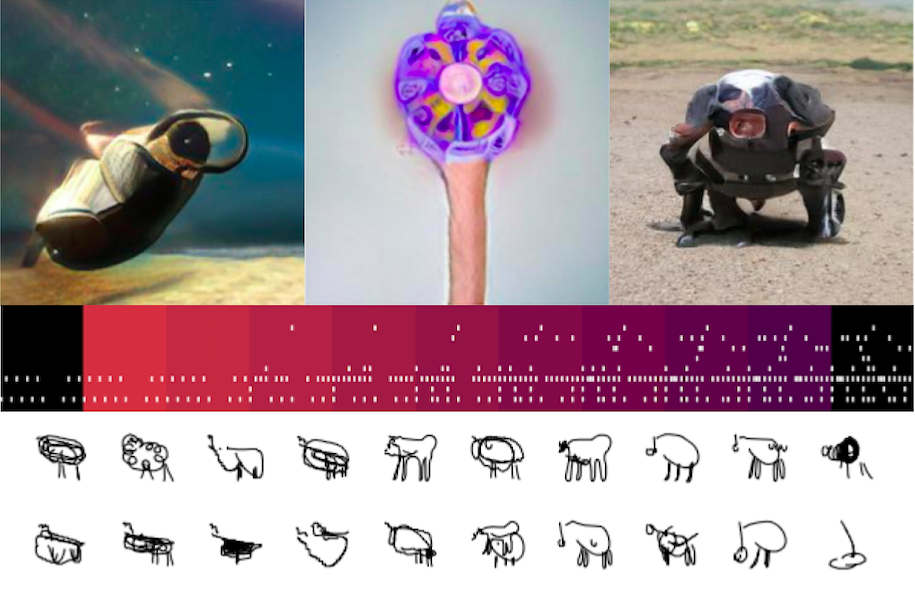

# EMAR 331/332 002 Innovation Studio: Embodied Code - Fall 2022

[Description](#description) | [Resources](#resources) | [Schedule](#schedule) | [Grading](#grading) | [Policies](#policies) | [References](#references)

<iframe width="800" height="450" src="https://www.youtube.com/embed/jX-uoOPfDg4" title="YouTube video player" frameborder="0" allow="accelerometer; autoplay; clipboard-write; encrypted-media; gyroscope; picture-in-picture" allowfullscreen></iframe>

<!-- -->

# Description

This innovation studio focuses on the Embodied Coding project, an National Science Foundation (NSF)-funded research project developing a visual coding language in VR and AR. Students will contribute as members of a multi-institutional research team developing the Embodied Coding Environment (ECE) in Unity; testing the existing system; and creating assets, exercises, and experiments as early users of the platform. These efforts lay the foundations for an upcoming research study with High School-aged novice programmers.

__Embodied Code__

Embodied Code is a platform for creative coding in Virtual and Augmented Reality (VR/AR). This flow-based visual coding system is designed to increase physical engagement with programming, and to lower the barrier to entry for novice programmers. It is conceptualized as a merged digital/physical workspace where spatial representations of code, the visual outputs of the code, and user interactions and edit histories are co-located in a virtual 3D space. Read more about the project here: [embodiedcode.net](http://embodiedcode.net/).

## Details

- **Instructor:** Dr. Robert Twomey
- **Class:** Tu/Th 11:00-12:15pm
- **Location:** CEMA 101E / and VR Lab
- **Office Hours:** Wed, Discord and in person (Cohab-Lab, CEMA 253)

## Course objectives
Students will:
- build experience with Unity, python, and C# development
- work hands-on with VR and AR in oculus quest 2, hololens, and related platforms
- design environments and User Interfaces (UI) for VR/AR in Unity.
- design creative coding exercises in VR for HS students.
- gain experience on grant-funded research (NSF) with external collaborators and clients (UC San Diego, Sweetwater School District)
- write scientific and research publications (as co-authors!), tutorials, learning materials

**Prequisites:** Major in Emerging Media Arts and successful completion of EMAR161 Computational Media Studio II, or permission of instructor.

# Resources
- **Discord:** [https://discord.gg/FTtktDsvPQ](https://discord.gg/FTtktDsvPQ)
- **Canvas:** [https://canvas.unl.edu/courses/137391](https://canvas.unl.edu/courses/137391)
- **VR Headsets:** we will develop with the Quest 2 headset
  - [SideQuest](https://sidequestvr.com/) for sideloading the embodied code app. 
- Unity for developing
- An IDE (VS Code or similar)

<!--
- **Discussion:** we will use discord for informal discussion, sharing, and asynchronous support. There is a `#ml-art-creative-ai` channel on the Carson Center server [https://discord.com/channels/688079641738608705/824358570161733643](https://discord.com/channels/688079641738608705/824358570161733643).
  - the server invite is posted on canvas.
- **Canvas:** this is where you will submit assignments, and where I will handle grading: [https://canvas.unl.edu/courses/124182](https://canvas.unl.edu/courses/124182)
- **Code:** code examples are here: [https://github.com/roberttwomey/ml-art-code](https://github.com/roberttwomey/ml-art-code)
- **Zoom:** [https://unl.zoom.us/j/94101425950](https://unl.zoom.us/j/94101425950)
  - this is our course zoom link. we will use it in the first two weeks, and for any one-on-one meetings with the prof.
- **Github Classroom:** this is where you will submit your code: [link to come]()
-->

# Schedule
(Subject to Change-Always check back for most up to date information)

| Week | Topic |
|------|-------|
| 1a | **[Class Introduction](sessions/week1.md#tuesday)** - Syllabus and Policies; Form teams; Distribute headsets |
| 1b | **[Setup VR](sessions/week1.md#thursday)**  - Activities: Discord setup. Meta accounts. Log on and enable developer mode  - Readings: NSF Abstract and Need-finding  - Exercise: Reading response |
| 2a | **[Intro to Embodied Code](sessions/week2.md#tuesday)**   Topics: embodied cognition; visual coding; ar/vr/xr affordances; somatic practice |
| 2b | **[Tutorials](/sessions/week2.md#thursday)** |
| 3-4 | **Hands on with Embodied Code**|
| 5-14| **Research (Task 1) and Development (Task 2)** | 
| 15-16 | **Final Presentations**  - final presentations - final reports |
| Finals | **Writeup and Documentation Due** |

# Grading

## Graded activities

- 15% Exercises
- 15% Tutorial / Documentation
- 30% Research
- 30% Development
- 10% Participation (Lab Notebook)

<!--
- 20% Weekly Exercises – approximately 10 exercises 
- 45% Projects – You will do three projects at 15% each*
  * Code, Documentation, and Results must be submitted for credit.
- 25% Final Project
  * Code
  * Documentation
  * Presentation
- 10% Participation
  * Finding and sharing resources on our course discussion. 
  * Small assignments/tasks as they arise, graded on completion.
  * Readings.
  * Any written proposals, work-in-progress updates, check-ins, etc., I request for individual projects.

*Work will be evaluated on the quality of concept, the degree of experimentation (both aesthetic and technical), and final realization (again, aesthetic and technical). Prompts and rubrics will be provided with more specific details regarding each assignment and breakdowns
-->

## Description of Assignments and Exams

__*Exercises*__ (ongoing)
We will have regular, weekly assignments involving research tasks, programming activities, or reading and responding. These will be short activities with clearly stated requirements. Projects will be graded on satisfactory completion with additional credit for creative, technical, expressive extension beyond requirements.

__*Tutorial*__ (weeks 1-4)
You will contribute to the getting started guide, documentation ([https://embodiedcode.net/docs/](https://embodiedcode.net/docs/)) or in-game tutorial syste for this project. This will be graded on clarity and completion.

__*Development*__ (weeks 5-16)
You will identify a development task (or tasks) within the embodied coding project, and do this development. This is one of the two main deliverables for this class. You will develop in Unity, Python, or within the Embodied Code system itself. We can help you come up with an idea for this.

__*Research*__ (weeks 5-16)
You will identify a research question that interests you around using the embodied coding project. You will learn about how to structure a research question, how to set up a study, and how to summarize and analyze results. You will also learn the basics of writing a research paper and publishing scientific literature. 

__*Lab Notebook*__ (ongoing)
Throughout the semester you will keep a lab notebook in google docs. This will be graded on completion. I will check this occasionally to stay abreast of your progress. This is a place to document your work. To keep track of bugs, questions, ideas that you have. Also a place to keep screenshots and other visual documentation.

## Late work policy
An assignment may receive an F if a student does not participate in every phase of the development of the project and meet all deadlines for preliminary materials (proposals, drafts, etc.). Failure to submit any of the graded course assignments is grounds for failure in the course. If a final draft or project, plus required addenda, is not submitted in class on the date due, it will be considered late and will lose one letter grade for each day or part of a day past due (A to B, etc.). Assignments are due in hard copy and or via email/link (online assignment). You must submit your assignments directly to the instructor. Any late submissions must be approved by your faculty instructor well in advance of the due date.

## Grading Scale
A+ = 97-100 | A = 93-97 | A- = 90-93  
B+ = 87-90 | B = 83-87 | B- = 80-83  
C+ = 77-80 | C = 73-77 | C- = 70-73  
D+ = 67-70 | D = 63-67 | D- = 60-63  
F = below 60% 

Here is a description of the kind of participation in the course that would earn you an A, B, C, etc. Your instructor may use pluses and minuses to reflect your participation more fairly, but this is a general description for each letter grade.

A – Excellent 
Excellent participation is marked by near-perfect attendance and rigorous preparation for class. You respond to questions and activities with enthusiasm and insight and you listen and respond thoughtfully to your peers. You submit rough drafts on time, and these drafts demonstrate a thorough engagement with the assignment. You respond creatively to the feedback you receive (from both your peers and instructors) on drafts, making significant changes to your writing between the first and final drafts that demonstrate ownership of your own writing process. Finally, you are an active contributor to the peer- review and collaborative writing/making processes.

B – Good 
Good participation is marked by near-perfect attendance and thorough preparation for discussion section. You respond to questions with specificity and make active contributions to creating a safe space for the exchange of ideas. You submit rough drafts on time, and these drafts demonstrate thorough engagement with the assignment. You respond effectively to the feedback you receive (from both your peers and instructor) on drafts, making changes to your work between the first and final drafts. You are a regular and reliable contributor to the peer-review and collaborative writing/making processes.

C – Satisfactory 
Satisfactory participation is marked by regular attendance and preparation for class. You respond to questions when prompted and participate in classroom activities, though you may sometimes be distracted. You are present, with few absences, and have done some of the reading some of the time. You submit drafts on time and make some efforts toward revision between the first and final drafts of an assignment. You are involved in peer-review activities, but you offer minimal feedback and you may not always contribute fully to the collaborative writing/making process.

D – Unsatisfactory 
Unsatisfactory participation is marked by multiple absences from section and a consistent lack of preparation. You may regularly be distracted by materials/technology not directly related to class. You submit late or incomplete work and revise minimally or only at a surface level between drafts. You are absent for peer-review activities, offer unproductive feedback, or do not work cooperatively in collaborative environments.

F—Failing 
Failing participation is marked by excessive absences, a habitual lack of preparation, and failure to engage in the drafting, revision, and collaborative writing/making processes.

# Policies

__UNL Course Policies and Resources__. Students are responsible for knowing the university policies and resources found on this page: [https://go.unl.edu/coursepolicies](https://go.unl.edu/coursepolicies)
- University-wide Attendance Policy
- Academic Honesty Policy
- Services for Students with Disabilities
- Mental Health and Well-Being Resources
- Final Exam Schedule
- Fifteenth Week Policy
- Emergency Procedures
- Diversity & Inclusiveness
- Title IX Policy
- Other Relevant University-Wide Policies

## Academic Honesty Policy

While we will adhere to the UNL Academic Honesty Policy linked above, we will use many open source projects to make our work. It is ok to use others' code. However, **you need to cite your sources**, and **you need to do transformative work/make it your own**.

## Attendance
On-time attendance is required as well as work inside and outside of section. Please notify your instructor in advance if you must be absent for illness or family emergency. Any absences must be cleared with the instructor, or justified with written documentation (e.g. letter from team, etc.). We do not differentiate between mental and physical health and in either case please be in communication for when you need to take a day off. After a student misses a week’s worth of classes each subsequent missed class will result in the reduction of the final grade by a full letter grade (i.e., A to B, B- to C-) Excessive tardiness or leaving early will also impact your grade and will follow the same rubric.

Please also note the JCSTF attendance policy:
- 4.7 Attendance Policy
- 4.7.1 After a student misses an equivalent of one week’s worth of classes, each subsequent missed
class will result in the reduction of the final grade by a full letter grade (i.e., A to B, B- to C-).
- 4.7.2 Students may be granted an excused absence at the instructor’s discretion.
- 4.7.3 Students may be granted an excused absence, at the instructor’s discretion, to allow those students to participate in extra-curricular events representing the University. In such cases, the instructor must be notified in advance.
- 4.7.4 This policy, as approved by the faculty, represents the minimum requirement. Faculty members are permitted to develop more stringent attendance requirements, as long as those requirements are detailed in writing in the class syllabus and distributed at the beginning of each course.
- 4.7.5 The policy on students who are late to class will be left up to the individual instructors.

# References
- National Science Foundation webpage: [NSF Award #2017042 - An Embodied, Augmented Reality Coding Platform for Pair Programming](https://nsf.gov/awardsearch/showAward?AWD_ID=2017042)
- Embodied Code documentation: [https://embodiedcode.net/docs/](https://embodiedcode.net/docs/)
- Embodied Code Website: [https://embodiedcode.net](http://embodiedcode.net/)

# Land Acknowledgment
We acknowledge that the University of Nebraska is a land-grant institution with campuses and programs on the past, present, and future homelands of the Pawnee, Ponca, Oto-Missouria, Omaha, Dakota, Lakota, Arapaho, Cheyenne, and Kaw Peoples, as well as the relocated Ho-Chunk, Iowa, and Sac and Fox Peoples. Please take a moment to consider the legacies of more than 150 years of displacement, violence, settlement, and survival that bring us together here today. This acknowledgement and the centering of Indigenous Peoples is a start as we move forward together for the next 150 years. 
